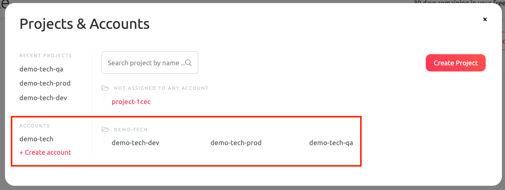
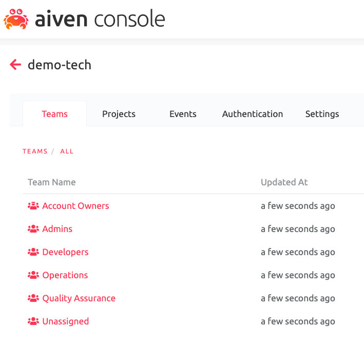
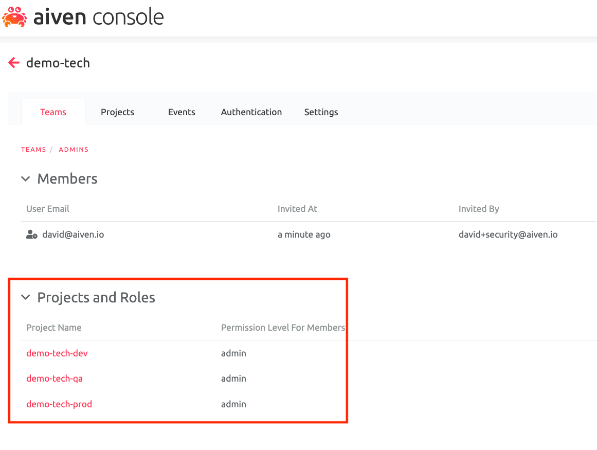
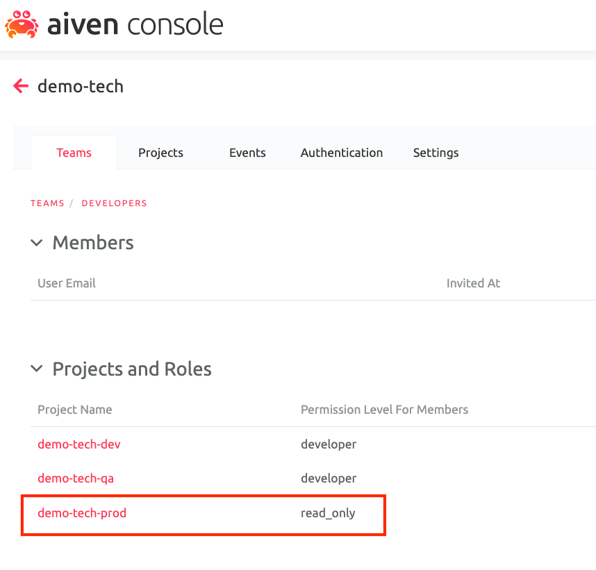
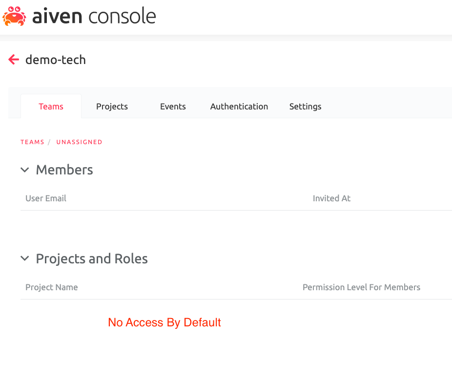

# Aiven Project, Account, and Teams Example

Please also read through our [help article](https://help.aiven.io/en/articles/3504926-account-management-in-console) that talks about setting up projects, accounts, and teams through the Aiven Console.

## Overview

We want to create an account and team setup to manage users and services
across `production`, `qa`, and `development` environments. See the
following table for roles and privileges:

|                 | Production Env. | QA Env.     | Development Env. |
|-----------------|-----------------|-------------|------------------|
| Admin Team      | `admin`         | `admin`     | `admin`          |
| Operator Team   | `operator`      | `operator`  | `operator`       |
| Developer Team  | `read_only`     | `developer` | `developer`      |
| Operator Team   | `read_only`     | `read_only` | `read_only`      |
| Unassigned Team | N/A             | N/A         | N/A              |

More information about [Aiven user roles](https://help.aiven.io/en/articles/923754-project-member-privileges) is available in our help center. The `unassigned` team is the default role for SSO registrations.

## Setup

### Install Aiven Terraform Provider

See [Installation Instructions](https://github.com/aiven/terraform-provider-aiven#installation).

### Variables

Rename `./secrets.tfvars.tmp` to `./secrets.tfvars` and fill in the appropriate values.

### Initialize Terraform

Ensure that you have Terraform v0.12.\* installed and initialize the project.

```sh
$ terraform --version && terraform init

Terraform v0.12.24
+ provider.aiven (unversioned)

Your version of Terraform is out of date! The latest version
is 0.12.28. You can update by downloading from https://www.terraform.io/downloads.html

Initializing the backend...

Initializing provider plugins...

Terraform has been successfully initialized!

You may now begin working with Terraform. Try running "terraform plan" to see
any changes that are required for your infrastructure. All Terraform commands
should now work.

If you ever set or change modules or backend configuration for Terraform,
rerun this command to reinitialize your working directory. If you forget, other
commands will detect it and remind you to do so if necessary.
```

# Apply

In a real-world deployment, you likely want to perform a `terraform apply` first. See [Hashicorp's Best Practices](https://www.terraform.io/docs/cloud/guides/recommended-practices/index.html) documentation for more information.

Deploy your changes

```sh
$ terraform apply --var-file=secrets.tfvars

An execution plan has been generated and is shown below.
Resource actions are indicated with the following symbols:
  + create

Terraform will perform the following actions:

  # aiven_account.acct will be created
...
Plan: 22 to add, 0 to change, 0 to destroy.

Do you want to perform these actions?
  Terraform will perform the actions described above.
  Only 'yes' will be accepted to approve.

  Enter a value: yes
...
aiven_account_team_project.rbac-qa-dev: Creation complete after 1s [id=a2d33b4d2ece/at2d33b4607c5/demo-tech-qa]

Apply complete! Resources: 22 added, 0 changed, 0 destroyed.
```

## Verify Aiven Projects' State







# Cleanup

```sh
$ terraform destroy --var-file=secrets.tfvars
...
Plan: 0 to add, 0 to change, 22 to destroy.

Do you really want to destroy all resources?
  Terraform will destroy all your managed infrastructure, as shown above.
  There is no undo. Only 'yes' will be accepted to confirm.

  Enter a value: yes

...
aiven_account.acct: Destruction complete after 0s

Destroy complete! Resources: 22 destroyed.
```
