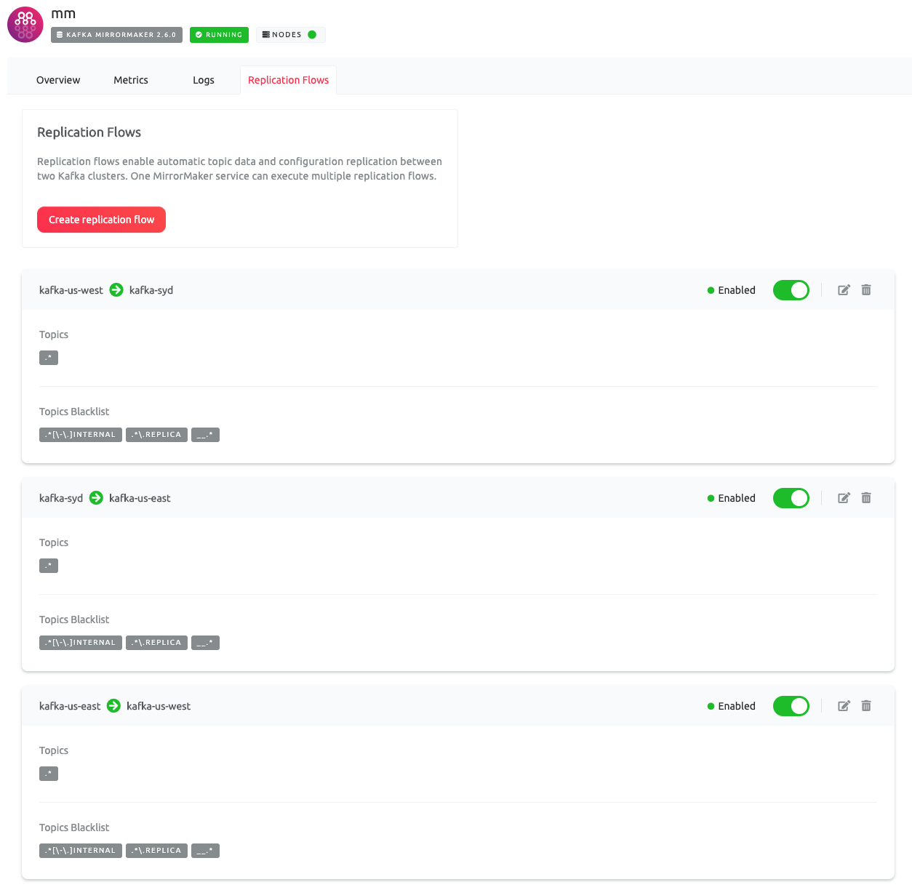

# Aiven Kafka MirrorMaker Global Example

## Overview

We want to create multiple kafka clusters and mirror messages between regions.
This setup includes a circular replication flow between three global regions.


## Setup

### Install Aiven Provider for Terraform

Update the `aiven` provider version in `main.tf`, e.g. `2.x.x => 2.1.0`.

The Aiven Provider for Terraform is offered on
the [Hashicorp Terraform Registry](https://registry.terraform.io/providers/aiven/aiven/latest).

### Variables

Rename `./secrets.tfvars.tmp` to `./secrets.tfvars` and fill in the appropriate values.

### Initialize Terraform

Ensure that you have at least Terraform v0.12.\* installed and initialize the project.

```sh
$ terraform init

Initializing the backend...

Initializing provider plugins...
- Finding aiven/aiven versions matching "2.1.0"...
- Installing aiven/aiven v2.1.0...
- Installed aiven/aiven v2.1.0 (self-signed, key ID BF63AFC521C50CB9)

Partner and community providers are signed by their developers.
If you would like to know more about provider signing, you can read about it here:
https://www.terraform.io/docs/plugins/signing.html

Terraform has been successfully initialized!

You may now begin working with Terraform. Try running "terraform plan" to see
any changes that are required for your infrastructure. All Terraform commands
should now work.

If you ever set or change modules or backend configuration for Terraform,
rerun this command to reinitialize your working directory. If you forget, other
commands will detect it and remind you to do so if necessary.
```

# Apply

In a real-world deployment, you likely want to perform a `terraform plan` first.
See [Hashicorp's Best Practices](https://www.terraform.io/docs/cloud/guides/recommended-practices/index.html)
documentation for more information.

Deploy your changes

```sh
$ terraform apply --var-file=secrets.tfvars .

An execution plan has been generated and is shown below.
Resource actions are indicated with the following symbols:
  + create

Terraform will perform the following actions:

...
Plan: 13 to add, 0 to change, 0 to destroy.

Do you want to perform these actions?
  Terraform will perform the actions described above.
  Only 'yes' will be accepted to approve.

  Enter a value: yes
...
aiven_kafka_topic.topic-a-ue1: Creation complete after 11s [id=david-demo/kafka-ue1/topic-a]

Apply complete! Resources: 13 added, 0 changed, 0 destroyed.
```

## Verify Aiven Projects State




# Cleanup

```sh
$ terraform destroy --var-file=secrets.tfvars .
...
Plan: 0 to add, 0 to change, 13 to destroy.

Do you really want to destroy all resources?
  Terraform will destroy all your managed infrastructure, as shown above.
  There is no undo. Only 'yes' will be accepted to confirm.

  Enter a value: yes

...
aiven_account.acct: Destruction complete after 0s

Destroy complete! Resources:13 destroyed.
```
